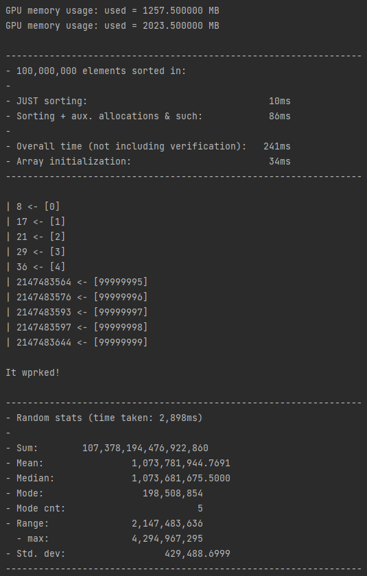
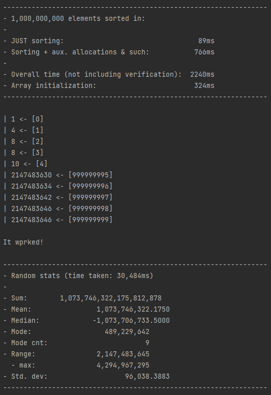

# Sorting competition (solo)

## Arrays.parallelSort (home):
Time taken to sort 1b elements:
 - 37900ms

I have no goddamn clue why it's so slow on my PC when my PC is better than the school PCs

Yes, I'm using JDK 19, no, I'm not running into pagefaults, yes I'm giving it 15g of heap space...
I guess it's getting a bit less CPU time on my PC, but that shouldn't make this much of a difference

Feel free to look at java_src/sort.java to see if I'm being stupid

## GPU radix sort (home pc):
100m (10k batch size):
  

1b (20k batch size, not sure why the stats took 30 sec, normally takes <15):
  

To run it, either:
 - Use Cmake (I use CLion with the bundled Cmake) and just build using that
 - Use nvcc directly:
   - `nvcc -O3 -arch=sm_86 main.cu main.cuh -run`
   - (Idk if it works below sm_80, haven't really been able to test)
   
Source URL:
 - N/A; it is my own code, only using things standard from the default CUDA toolkit (11.8)

Previous approaches:
 - I attempted to make my own radix sort, but it wasn't the most consistent, and the library version
   is much more optimized

## GPU radix sort (school pc in engineering room w/ 3070s):
Times were *about* the same time as above, but Idk if it counts since it's the engineering room
(Simply precompiling an executable and running it on the school pc worked since it's the same arch as mine)

## CPU parallel radix sort (cs room pc):
Time taken to sort 1b elements:
 - 3205ms

To run it, use your C++ compiler of choice (I used gcc):
 - `g++ -O3 -fopenmp measure.cc; ./a.exe`

Source URL:
 - https://github.com/iwiwi/parallel-radix-sort
 - I just modified `measure.cc` to meet my requirements and stop sorting excess arrays

Previous approaches:
 - Other frantic GitHub searches
